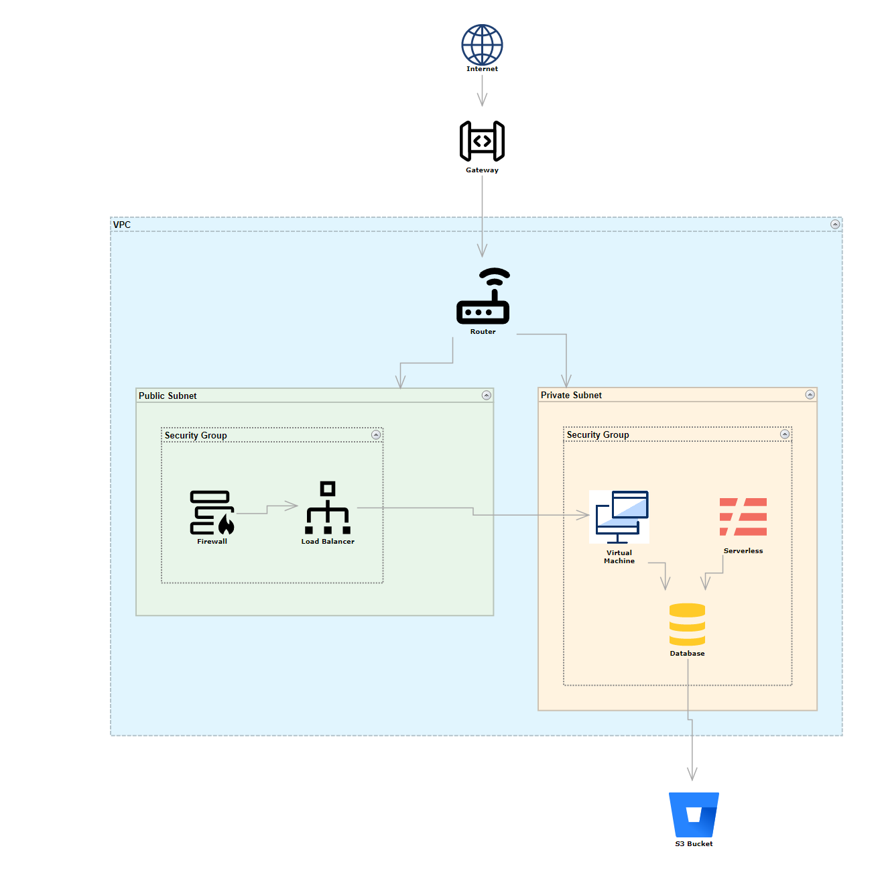

# Cloud Infrastructure Designer for Avalonia

A professional-grade sample application demonstrating the power of **MindFusion.Diagramming for Avalonia**. This tool allows users to design, organize, and export complex cloud infrastructure architectures (AWS, Azure, GCP style) with a modern, high-performance UI.



## 🚀 Key Features

- **Rich Cloud Palette**: 11 unique components including Virtual Machines, Databases, Load Balancers, Gateways, and more.
- **Hierarchical Containers**: Build structured networks using **VPCs**, **Public/Private Subnets**, and **Security Groups** with automatic nesting and folding support.
- **High-Quality Visuals**: 
  - Crisp **SVG & PNG** icon integration.
  - Professional **Ruler** and **Grid Snapping** for precise alignment.
  - Subtle technical link styling with refined arrowheads.
- **Interactive Property Panel**: Real-time synchronization of node labels and detailed descriptions (tooltips).
- **Auto-Layout Engine**: Instantly organize messy diagrams into clean, hierarchical flows using the built-in `LayeredLayout`.
- **Pro Export**: Save your final architecture designs as high-resolution PNG images via standard system dialogs.

## 🛠️ Built With

- [Avalonia UI](https://avaloniaui.net/) - Cross-platform XAML framework.
- [MindFusion.Diagramming for Avalonia](https://mindfusion.eu/avalonia-diagram.html) - Professional flowchart and diagramming library.
- [Svg.Controls.Skia.Avalonia](https://github.com/wieslawsoltes/Svg.Skia) - High-performance SVG rendering.

## 📋 Getting Started

### Prerequisites
- .NET 10.0 SDK
- Avalonia 12.x
- MindFusion.Diagramming.Avalonia 0.8.0+

### Setup
1. Clone the repository.
2. Ensure the `Icons/` folder contains your cloud assets.
3. Build and run the project:
   ```bash
   dotnet build
   dotnet run
   ```

## 📂 Project Structure

- `MainWindow.axaml`: The three-pane UI layout (Palette, Canvas, Properties).
- `CloudNode.cs`: Custom node definition for cloud resources.
- `App.axaml`: Global styles for technical links and specialized nodes.
- `Icons/`: SVG and PNG assets for infrastructure components.

---
*Created as a sample for the MindFusion Diagramming beta for Avalonia.*
