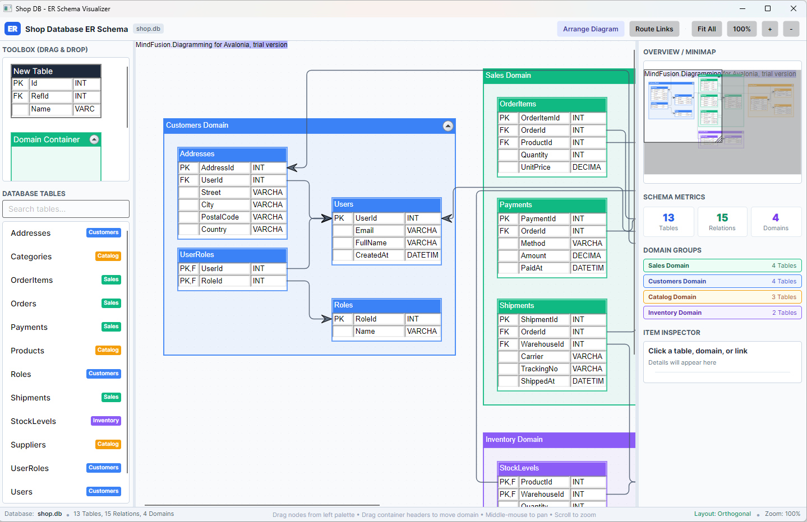
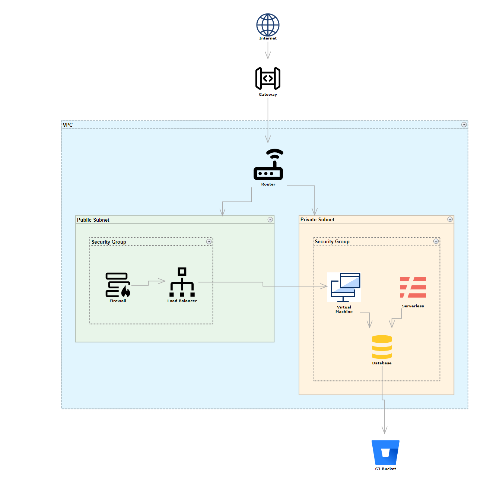

# MindFusion.Diagramming for Avalonia - Samples

This repository contains a comprehensive collection of sample applications for the **MindFusion.Diagramming for Avalonia** library. These samples demonstrate everything from basic diagram creation to advanced features like automatic layouts, custom styling, and complex infrastructure design.

## Featured Sample: Database ER Schema Visualizer

An interactive Entity-Relationship (ER) diagram application built with **Avalonia UI** and **MindFusion.Diagramming for Avalonia**, dynamically visualizing the schema of a SQLite database (`shop.db`).

### Key Features

- **Dynamic Schema Extraction**: Automatically reads tables, columns, data types, primary keys, and foreign keys directly from SQLite.
- **TableNode Representations**: Each database table is rendered as an ER table node with domain color-coding, `PK` / `FK` key indicators, and row-level relationship connection anchors.
- **Domain Container Groups**: Tables belonging to related domains (*Sales*, *Customers*, *Catalog*, *Inventory*) are grouped inside foldable `ContainerNode`s.
- **Dual Graph Layouts**:
- **Orthogonal Layout**: Balanced, compact arrangement preserving container boundaries.
- **Layered Layout**: Hierarchical dependency-flow layout respecting foreign-key chains.
- **Link Routing**: Cascading orthogonal relationship lines routed around table nodes and container walls.
- **3-Pane Workspace**:
- **Left**: `NodeListView` tool palette for drag-and-drop diagramming + searchable table directory with instant click-to-focus.
- **Center**: Interactive `DiagramView` canvas with grid points, smooth middle-click panning, and wheel zooming.
- **Right**: Real-time `Overview` minimap, schema metrics, and an element inspector for tables, columns, containers, and foreign-key links.



## Sample: Cloud Infrastructure Designer
The newest addition to our collection, demonstrating a professional-grade architecture tool.
- **Location**: `/CloudDesigner`
- **Highlights**: SVG icon integration, hierarchical containers (VPCs/Subnets), grid snapping, and professional PNG export.



## 📂 Samples Overview

### Tutorials
Step-by-step guides to get you started with the library.
- **Tutorial 1**: Building a diagram dynamically from XML and using `LayeredLayout`.
- **Tutorial 2**: Creating tree structures and basic node interactions.
- **Tutorial 3**: Customizing node appearance with XAML DataTemplates.

### Core Features
- **AnchorPoints**: Defining and using custom connection points on nodes.
- **Containers**: Nested grouping of nodes with folding/unfolding support.
- **Controls**: Using auxiliary components like `Palette`, `Ruler`, `Overview`, and `ZoomControl`.
- **Inheritance**: Demonstrating the class hierarchy and extending base node types.
- **StockShapes**: A showcase of the built-in shape library.

### Layout & Algorithms
- **FractalLayout**: Arranging nodes in a tree-like fractal structure.
- **LayeredLayout**: Organizing nodes into distinct layers for flowcharts.
- **TreeMap**: Visualizing hierarchical data using nested rectangles.
- **PathFinder**: Shortest path and connectivity analysis between nodes.

### Specialized Diagrams
- **SequenceDiagram**: Implementing UML-style sequence interactions.
- **FreeForm**: User-drawn shapes and organic diagramming.
- **SpanningCells**: Complex table nodes with merged cells and icons.

### Performance & Events
- **StressTest**: Demonstrating the library's performance with thousands of items.
- **EventLogger**: A diagnostic tool for tracking diagram interactions and lifecycle events.

## Technical Requirements
- **Framework**: Avalonia UI 12.x
- **Runtime**: .NET 10.0 SDK
- **Library**: MindFusion.Diagramming.Avalonia (Beta)

## Getting Started
1. Clone the repository.
2. Open the individual `.slnx` files or the main project folder in Visual Studio or VS Code.
3. Build and run any sample using the .NET CLI:
   ```bash
   cd CloudDesigner
   dotnet run
   ```

## About 
These samples are provided as-is for demonstration purposes. Use of the MindFusion.Diagramming library is subject to the [MindFusion License Agreement](https://mindfusion.eu/eula.html).

---
*For more information, visit the [MindFusion Diagramming for Avalonia Product Page](https://mindfusion.eu/avalonia-diagram.html).*
